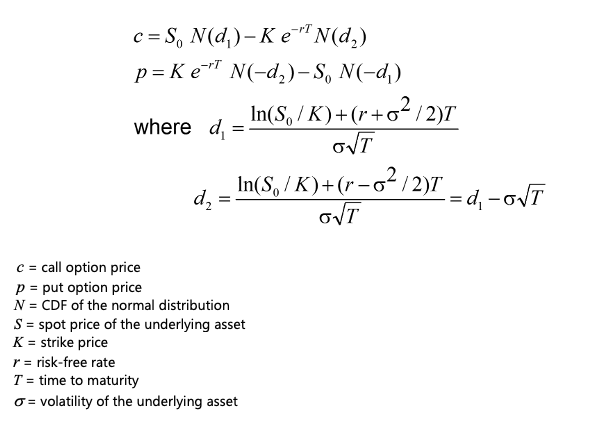

## Black-Scholes Option Pricing Model with Greeks
Developed in 1973 by Fischer Black and Myron Scholes, the Black-Scholes model is a mathematical model of financial derivative markets. In their initial paper, ["The Pricing of Options and Corporate Liabilities"](https://www.jstor.org/stable/1831029?origin=JSTOR-pdf), they introduce this model based on a partial differential equation, from which the Black-Scholes formula is derived. The formula is used to calculate the theoretical value of an options contract. Later that year, Robert Merton published a follow-up paper, ["Theory of Rational Option Pricing"](https://www.jstor.org/stable/3003143), expanding the mathematical understanding and applications of the model.

The Black-Scholes formula can be expressed as follows:

,

Additionally, the Black-Scholes model provides important insights into the dynamics of option pricing (i.e., Option Greeks). It introduces the concept of delta, which measures the sensitivity of an option's price to changes in the price of the underlying asset, and gamma, which measures the rate of change of delta with respect to changes in the price of the underlying asset. The model also provides formulas for calculating other option related measures such as vega (sensitivity to changes in volatility), theta (time decay), and rho (sensitivity to changes in the risk-free rate).

I wrote Python code that uses this model to price an option and calculate its Greeks, given a set of input values.

## Model Assumptions
Market:
* Markets are random.
* There are no transaction costs.
* The risk-free rate is constant.

Option / Underlying:
* The option is European and so can only be exercised at expiration.
* No dividends are paid out during the life of the option.
* The volatility of the underlying asset is constant.
* The returns of the underlying asset are normally distributed.

## Resources
* [The Python Standard Library](https://docs.python.org/3/library/)
* [Stack Overflow](https://stackoverflow.com)